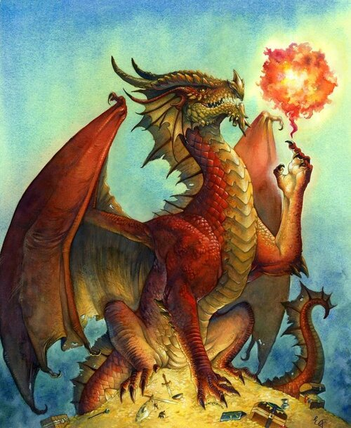
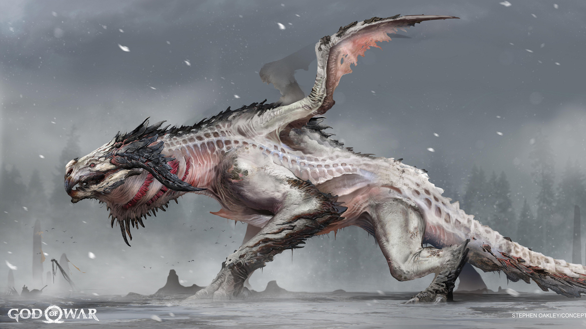
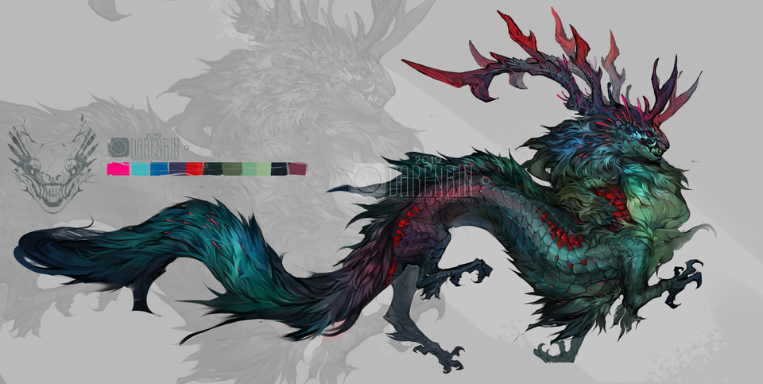

Link to repository:https://github.com/TramooD17/Dragon-Phylogeny
Expanding the Dragon Phylogeny  

The following three dragons have been discovered recently. In this report, we will attempt to trace their genetic ancestries by phylogeny. 
(They will be named after the artists that drew them.)

```{r img-with-knitr, echo=FALSE, fig.align='center', out.width='100%', fig.cap='Image from http://www.lissgallery.com/dnd'}

```
Emily Fiegenschuh - Cover Art for A Practical Guide to Dragon Magic (LE) via http://www.lissgallery.com/dnd

```{r img-with-knitr, echo=FALSE, fig.align='center', out.width='100%', fig.cap='Image from https://www.artstation.com/possum'}

```
Stephen Oakley - God of War Dragon Concept Art via https://www.artstation.com/possum

```{r img-with-knitr, echo=FALSE, fig.align='center', out.width='100%', fig.cap='Image from https://www.reddit.com/r/dragons/comments/dngl7c/dragon_concept_art_by_me/'}

```
Darenrin - Dragon concept via https://www.reddit.com/r/dragons/comments/dngl7c/dragon_concept_art_by_me/

Loading the needed packages:
```{r}
library(ape)
library(reshape2)
library(ggplot2)
library(ggtree)
```

The dragons "Emily", "Stephen" and "Darenrin" were added to the DragonNexus file using TextEdit.

```{r}
DragonNexus <- read.nexus.data("./input/DragonMatrix.nex")
```

Weights were added to the traits to take into account those that are more strongly or weakly selected for in evolution.
```{r}
WeightsDat <- read.csv("./Weights.csv")
Weights <- paste0(WeightsDat$Weight,collapse="")
Weights <- strsplit(Weights,split="")[[1]]

WeightsNum<-rep(NA,length(Weights))
for(i in 1:length(WeightsNum)){
  if(Weights[i] %in% LETTERS){
    WeightsNum[i]<-which(LETTERS==Weights[i])+9
  } else {
    WeightsNum[i]<-Weights[i]
  }
}
WeightsNum<-as.numeric(WeightsNum)

WtDragonNexus<-DragonNexus
for (i in 1:length(DragonNexus)){
  RepWeight<-DragonNexus[[i]]==1
  WtDragonNexus[[i]][RepWeight]<-WeightsNum[RepWeight]
  RepWeight<-NA
}
```

A distance matrix is made as a prerequisite for generating the phylogenetic tree, first by turning the nexus file into a data frame and then visualizing.
```{r}
WtDragonNexusDF <- data.frame(matrix(unlist(WtDragonNexus),ncol=78,byrow=T))
row.names(WtDragonNexusDF) <- names(WtDragonNexus)
WtDragonDist <- dist(WtDragonNexusDF,method='euclidean')
WtDragonDistMat <- as.matrix(WtDragonDist)
```
```{r}
WtPDat <- melt(WtDragonDistMat)
```
```{r}
ggplot2::ggplot(data = WtPDat, aes(x=Var1, y=Var2, fill=value)) +
  geom_tile() +
  scale_fill_gradientn(colours = c("white", "blue", "brown", "green")) +
  theme(axis.text.x = element_text(angle = 90, hjust = 1, vjust = 0.5))
```
Figure 1. Distance matrix of the dragon phylogeny.

The phylogenetic tree was then plotted. We will analyze which country each new dragon species likely belong to.
```{r}
WtDragonTree <- fastme.bal(WtDragonDist)

Country<-gsub("[0-9\\.]+([^X]+)X*","\\1",row.names(WtDragonNexusDF))

CountryGroups<-split(row.names(WtDragonNexusDF), Country)

WtDTcol<-groupOTU(WtDragonTree,CountryGroups)

ggtree(WtDTcol,branch.length = 'none', layout="circular",aes(colour=group)) +
  geom_tiplab(size=2,aes(angle=angle))
```
Figure 2. Phylogenetic tree of the dragon lineages, colour-grouped by country.

In Figure 2, we can see that Emily and Stephen are closely related to each other, with Darenrin being the next-closest relative. Tracing back to the next node shows that the three new dragon species are most closely related to Japanese dragons.
